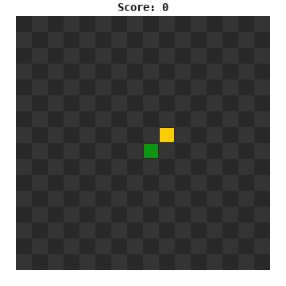
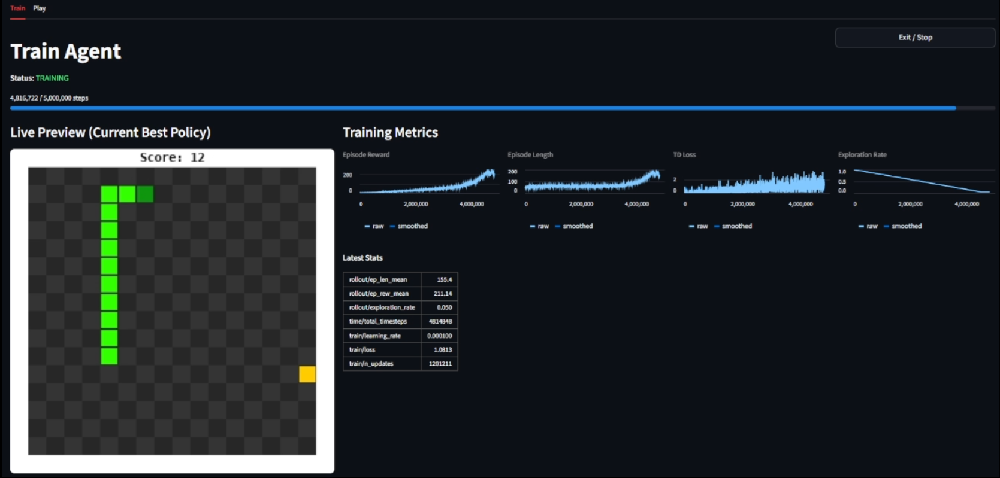

# Snake RL

[](https://github.com/jgalloway42/snake_rl/actions/workflows/ci.yml)

---

<div align="center">



</div>

## Abstract

This project trains a reinforcement learning agent to play the game Snake using Deep Q-Learning (DQN). A custom Gymnasium environment provides a headless, testable game engine. The agent observes a compact 11-feature encoding of game state — danger signals, food direction, and heading — and outputs one of three relative actions. A custom PyTorch MLP serves as the Q-network, integrated with Stable Baselines3. The full experiment pipeline is config-driven, with hyperparameters in YAML and every run tracked in MLflow. After 5 million training steps the agent achieves a mean episode reward of **209.3** and a mean score of **~13** food items per episode.

---

## Dataset

There is no external dataset. Experience is generated online through agent–environment interaction within a custom 16×16 Snake environment built to the Gymnasium interface.

At each step the agent receives an observation, selects an action, and the environment returns the next observation, reward, and termination signal. Transitions `(s, a, r, s', done)` are stored in a replay buffer of capacity 100,000. Mini-batches of 32 transitions are sampled uniformly for each gradient update, decoupling the training distribution from the order of experience collection.

Before RL training begins, 5,000 transitions from a rule-based heuristic agent seed the replay buffer. The heuristic avoids immediate collisions and moves toward food, providing a better initial data distribution than purely random exploration and accelerating early learning.

---

## Data Representation and Processing

**Observation space — 11 features**

Rather than flattening the full grid (768 values for a 16×16 board with 3 channels), the environment exposes a compact vector of 11 binary features:

| Feature group | Features | Encoding |
|---|---|---|
| Danger | Collision if STRAIGHT, TURN_LEFT, TURN_RIGHT | 3 binary flags, relative to current heading |
| Food direction | Food is left / right / up / down | 4 binary flags, absolute |
| Heading | Current direction of travel | 4-element one-hot |

All danger signals are expressed relative to the snake's current heading, making the representation position-invariant. The MLP sees the same feature pattern regardless of where on the board the snake is, which reduces the effective state space and improves generalisation.

**Action space — 3 relative actions**

The agent outputs one of `{STRAIGHT, TURN_LEFT, TURN_RIGHT}`. Using relative rather than absolute directions eliminates the illegal 180° reversal from the action space and simplifies the policy's credit-assignment problem.

**Reward design**

| Signal | Value | Rationale |
|---|---|---|
| Food eaten | +16.0 | Primary learning signal; scaled to reduce value-function variance |
| Survival (per step) | +0.01 | Creates a clean incentive hierarchy: eating > surviving > dying |
| Collision | 0.0 | Death is implicitly costly through forfeiture of future survival credits |

Distance-shaping signals (toward/away) are disabled. DQN propagates the value of proximity to food backward through the replay buffer via TD bootstrapping, so hand-crafted shaping is not needed and risks introducing local optima.

---

## Model Derivation

| Layer | Technology |
|---|---|
| RL algorithm | Stable Baselines3 — DQN (Double DQN) |
| Policy network | PyTorch (custom MLP) |
| RL environment | Gymnasium |
| Game engine | Pure Python (headless) |
| Rendering | pygame |
| Experiment tracking | MLflow |
| Demo app | Streamlit |
| Testing | pytest + pytest-cov |

**Algorithm — Double DQN**

DQN with a replay buffer is well-suited to this problem. The replay buffer lets rare food-eating transitions be replayed many times, addressing the sparse-reward challenge. The Double DQN target (SB3 default) decouples action selection from value estimation in the Bellman target, reducing Q-value overestimation of safe but suboptimal wandering states.

**Q-network architecture**

A custom `nn.Module` (SnakeMLP) is integrated with SB3 via `BaseFeaturesExtractor`:

```
Input (11)  →  Linear(64, ReLU)  →  Linear(256, ReLU)  →  Linear(128, ReLU)  →  Q-values (3)
```

The feature extractor produces a 64-dimensional embedding; two hidden layers of width 256 and 128 follow before the output head.

**Key hyperparameters**

| Parameter | Value | Rationale |
|---|---|---|
| `buffer_size` | 100,000 | Stores ~20 full episodes; large enough for diverse batches |
| `learning_starts` | 10,000 | Random exploration before first gradient update ensures a populated buffer |
| `gamma` | 0.99 | High discount appropriate for a long-horizon task |
| `exploration_fraction` | 0.9 | Epsilon decays from 1.0 → 0.05 over 90% of training, ensuring thorough exploration before the policy commits |
| `target_update_interval` | 1,000 | Hard target-network sync; infrequent enough to stabilise training |
| `heuristic_prefill_steps` | 5,000 | Warms the replay buffer with competent transitions before RL begins |

---

## Results

<div align="center">



</div>

| Metric | Value |
|---|---|
| Mean episode reward | 209.3 |
| Mean episode length | 159.4 steps |
| Mean score (food items) | ~13 |
| Total timesteps | 5,000,000 |

---

## Conclusion

A compact relative observation encoding, a three-action relative action space, and a survival-credit reward structure together produce a well-conditioned learning problem. Double DQN with a large replay buffer and heuristic pre-fill provides stable credit assignment despite the sparse food reward signal. Thorough exploration — epsilon decaying over 90% of training — avoids premature policy commitment before the Q-function has seen enough positive transitions.

**Potential directions for improvement**

- **CNN policy** — replace the MLP with a NatureCNN-style extractor operating on the raw 3-channel grid observation, allowing the network to learn spatial features automatically
- **Prioritized Experience Replay** — amplify rare food-eating transitions during sampling via a custom SB3 `ReplayBuffer` subclass
- **Longer training** — the current reward curve suggests the agent has not yet fully saturated; additional timesteps may continue to improve performance

---

→ [Getting started](QUICKSTART.md)
